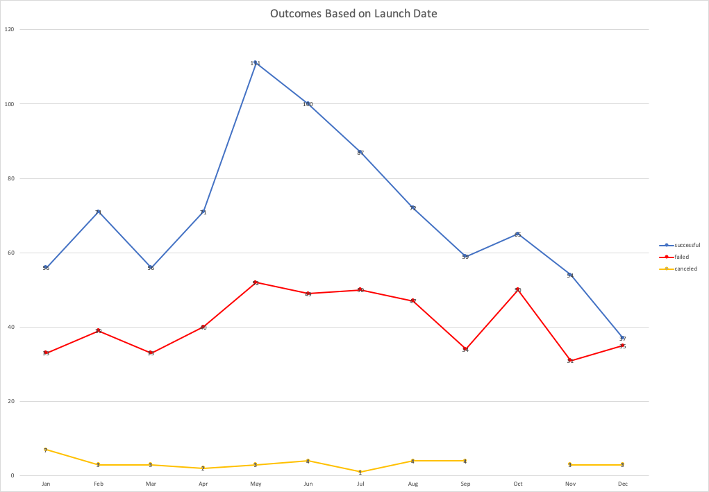
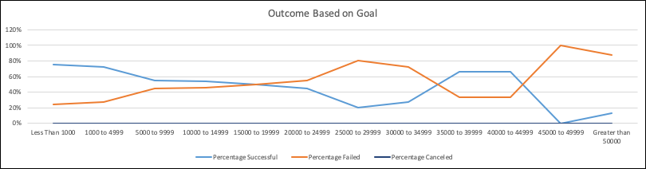

# Kickstarting with Excel
Submitted by Isaac D. Tucker-Rasbury
---

## Overview of Project
A client interested in the success of fundraising campaigns, Louise, has enlisted our assistance
to explore how different campaigns fared in relation to their launch dates and funding goals. 
She recently conducted her on fundraising campaign and now has questions about how some factors 
contribute to the outcome of a campaign. The project goal here is to analyze and visualize
the relationships between the outcomes of different campaigns and the explanatory variables
Louise is interested in: a) launch dates, and b) [fundraising] goals. We are using the 
kickstarter dataset already provided to us so we are skipping over the stage of the 
project where we need to locate or clean data; and, we are focusing on analysis and creating informative charts.

### Purpose
First, analyze the dataset to search for the relationships between the following three 
variables: "outcome", "goal", and/or "launched date" with particular attention to the subcategory
plays. Second, visualize the meaningful relationships in the data for quick consumption by the client.

## Analysis and Challenges
The analysis conducted herein consists of two parts. The first looking at outcomes based on
launched date aggregates outcomes at month intervals and charts those figures over time to
show how the launch date of a project contributes to outcomes. The findings were significant and 
I will get into exactly how below. The second part of the analysis looked at outcomes based on 
fundraising goals. The data for this analysis consisted of a handmade table that used =countifs()
statements to locate and sum observations that fit multiple criteria. From there the findings were
turned into percentages and charted to show how "successful", "failed", and "canceled" campaigns
faired as they shifted from one bracket of fundraising goal amounts to another.

### Analysis of Outcomes Based on Launch Date
The first relationship I analyzed was outcomes as a function of launch date. I converted the 
variable "launched at" into usable and readable information using a unix time conversion method.
After that, I created a pivot table on the available data to aggregate outcomes at month intervals 
and charted those figures over time to show how launch date contributes to a campaigns outcome. 

Here we can take away two key conclusions. The first conclusion is that campaigns launched in 
Q2 of a year had the highest rate of success. The second conclusion is that the most uncertain time of year
to launch a project is in December, when the "successful" and "failed" campaigns have similar 
results.

### Analysis of Outcomes Based on Goals
The second part of the analysis looked at outcomes based on fundraising goals. The data for this analysis consisted of a handmade table that used =countifs()
statements to locate and sum observations that fit multiple criteria. From there the findings were
turned into percentages and charted to show how "successful", "failed", and "canceled" campaigns
faired as they shifted from one bracket of fundraising goal amounts to another.

From this graph we can conclude that campaigns with fundraising goals from 0 to 2000 and 
3500 to 5000 have a higher rate of a success. From 2000 to 3500 and above 5000, campaigns
see less success.

### Challenges and Difficulties Encountered
I experienced two notable difficulties during this analysis. The first was finding the 
right pivot table settings to get a month breakdown of outcomes. By trial and error I was 
able to find that by removing the year breakdown in the row field of the pivot table, I was
able to get to the aggregated outcomes by month. The second difficulty was using the countifs 
function. For a time, my figures were incorrect and I could not figure out why. I used the 
class slack channel to see if anyone else had asked the same question I was about to ask and 
found that they had. The issue was in how I was coding the criteria for fundraising goal amounts and 
I figured out the issue while reading a peer's code. The issue was resolved after I corrected my code.

I had the following:
=COUNTIFS(Table2[outcomes], "successful", Table2[goal], ">1000", Table2[goal], "<4999", Table2[Subcategory], "plays")

I was missing the equal signs to include outcomes equal to the numbers at the end of the goal 
thresholds.
=COUNTIFS(Table2[outcomes], "successful", Table2[goal], ">=1000", Table2[goal], "<=4999", Table2[Subcategory], "plays")

## Results

- What are two conclusions you can draw about the Outcomes based on Launch Date?
From looking over the Outcomes Based on Launch Date graph, we can, first, conclude that campaigns 
for theater more often have "successful" outcomes than "failed" outcomes. Second we can 
conclude that the best time to launch a campaign is in Q2 of a year, circa April, May, and June.

- What can you conclude about the Outcomes based on Goals?
From looking over the Outcomes based on Goals graph, we see that there is no correlation between
canceled campaigns and fundraising goals, but as I stated above "campaigns with fundraising
 goals from 0 to 2000 and 3500 to 5000 have a higher rate of a success."

- What are some limitations of this dataset?
This dataset has the following limitations:
a) there is no legend in the dataset explaining the rationale behind each variable.
b) the observations lack a code for subject matter which would allow us to see which campaigns
faired the best by subject.
