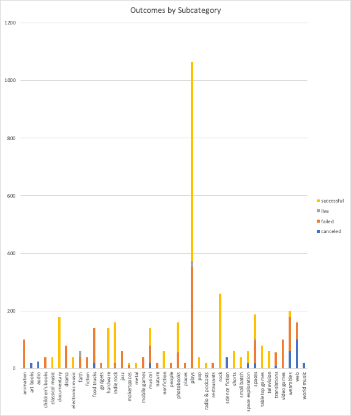

# An-Analysis-of-Kickstarter-Campaigns
Herein lies ananalyzed data concerning fundraising campaigns, compiled for the benefit of our client, Louise. Our client intends to use this analysis to improve the likelihood of success of her own fundraising campaign. to assist her with her campaign, we analyzed fundraising campaign data using time series, geographic, and outcome variables available in the dataset and identified the central tendencies of the dataset by outcome.
---
In short, we found that campaigns supporting plays launched in April, May, or June (or Q2 of a year) with a goal of approximately $5,000 would likely obtain 3/5ths of that amount or more and received more money per average pledge. However, we found that the higher the goal amount the lower the average amount per pledge.
--
##Analysis

